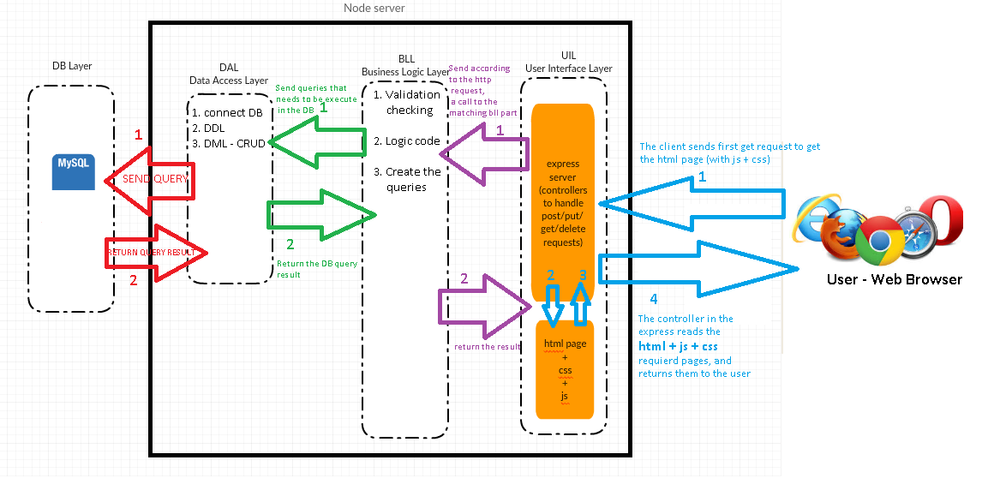
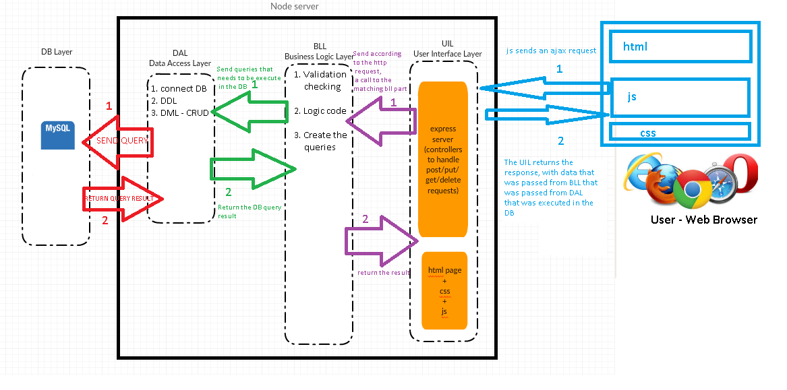

# N-Tier nodel - Nodejs App
***
### First request:

***
### After First request:

***

# Statistics for Trivia game
* Every Trivia query that is sent to the user contains:
```
queryId              - int
query                - string
optionA              - string
optionB              - string
optionC              - string
optionD              - string
optionCorrect        - string
```
for example:
```json
{
    "queryId":2,
    "query":"what is the Capital of Bermuda: ",
    "a":"Hamilton",
    "b":"Phnom Penh",
    "c":"Tripoli",
    "d":"Asunción",
    "correct":"Hamilton"
}

```
* Create "queryStatistics"  DB table with this columns:
```
id                   - auto-increment
subject              - string
query                - string
optionA              - string
optionB              - string
optionC              - string
optionD              - string
optionCorrect        - string
sumOfAnswers         - int
sumOfRightAnswers    - int
```

* Create "queryToUser" DB table with this columns:
```
id                   - auto-increment
queryId              - int
userId               - int
isCorrect            - bit
```


***

* Before we create a new query - the code checks in the DB if we have a query in the chosen subject,
that the user has not answered before:   
    - If we have a query - we will send this query to the user
    - If we do not have a query - we will create a new query, and save it in the DB "queryStatistics"
        - When we create a new query - we will check in the DB if we have allready a same query - if yes - we will create a new query

***

* When the user returns an answer to the query:
    - we will add to "queryToUser" a new record with the matching data
    - we will edit in "queryStatistics" the matching record:
        - increment by 1 the "sumOfAnswers"
        - if the user answered right - increment by 1 the "sumOfRightAnswers"
